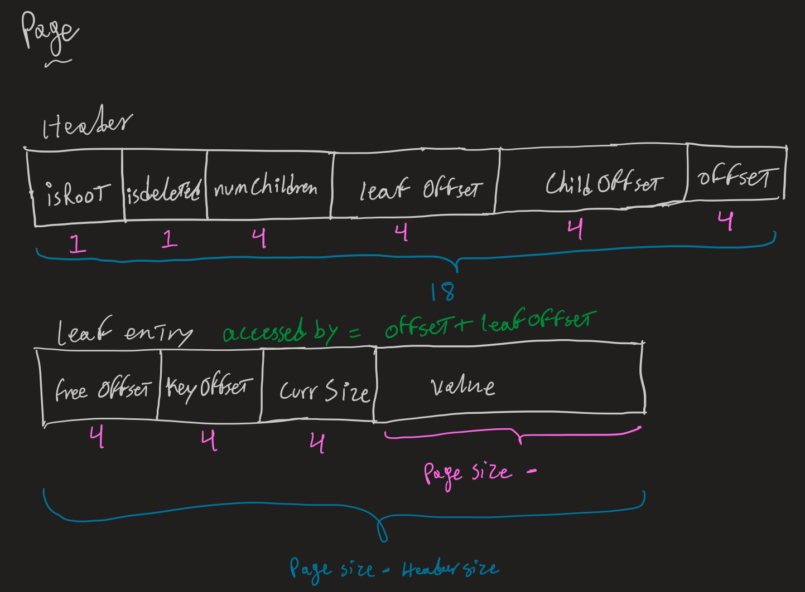

# B+ Trees on Disk
## Resources
Kagi's b+tree was implemented with a whole of coffee & referencing these resources:  
1. https://www.oreilly.com/library/view/database-internals/9781492040330/ch04.html  
2. https://medium.com/@pthtantai97/implement-key-value-store-by-btree-5a100a03da3a  
3. https://cstack.github.io/db_tutorial/parts/part8.html  
4. http://web.archive.org/web/20161221112438/http://www.toadworld.com/platforms/oracle/w/wiki/11001.oracle-b-tree-index-from-the-concept-to-internals  
5. https://webdocs.cs.ualberta.ca/~holte/T26/lecture10.html  

## Structure
non-accurate sketch
  

**Header:**  
- flags: describes node content  
  * isRoot: true if the node is root node  
  * isDeleted: true if node was deleted indicating that cleanup is needed  
- offSet: the position of node  
- parentOffset: position of parent node  
- numChildren: number of children nodes  
- childOffset: offset of the first child node
  
**Entry:**  
- currSize: current size of the value  
- freeOffset: offset or where the free space starts  
- value: string value of the leaf  
