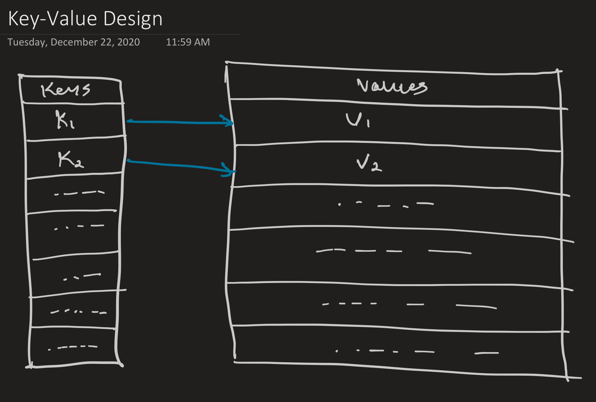
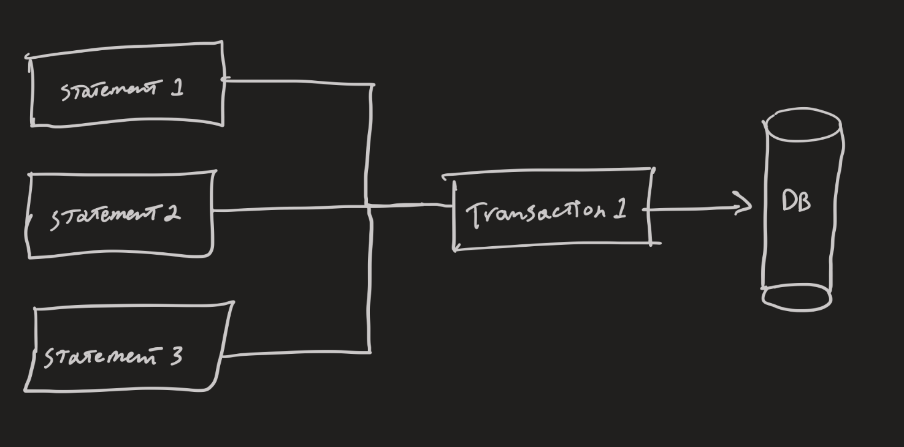
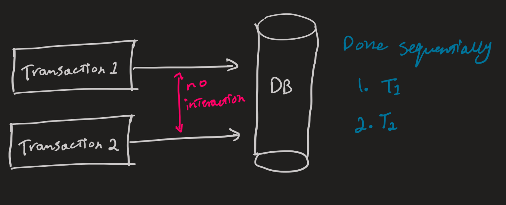

# Key-Value Design
  

## Key-Value Operations
Table from [here](https://www.freecodecamp.org/news/design-a-key-value-store-in-go/)  
<table>
  <thead>
  <tr>
  <th align="center">Command</th>
  <th align="center">Description</th>
  </tr>
  </thead>
  <tbody>
  <tr>
  <td align="center"><code>SET</code></td>
  <td align="left">Sets the given key to the specified value. A key can also be updated.</td>
  </tr>
  <tr>
  <td align="center"><code>GET</code></td>
  <td align="left">Prints out the current value of the specified key.</td>
  </tr>
  <tr>
  <td align="center"><code>DELETE</code></td>
  <td align="left">Deletes the given key. If the key has not been set, ignore.</td>
  </tr>
  <tr>
  <td align="center"><code>COUNT</code></td>
  <td align="left">Returns the number of keys that have been set to the specified value. If no keys have been set to that value, prints 0.</td>
  </tr>
  <tr>
  <td align="center"><code>BEGIN</code></td>
  <td align="left">Starts a transaction. These transactions allow you to modify the state of the system and commit or rollback your changes.</td>
  </tr>
  <tr>
  <td align="center"><code>END</code></td>
  <td align="left">Ends a transaction. Everything done within the "active" transaction is lost.</td>
  </tr>
  <tr>
  <td align="center"><code>ROLLBACK</code></td>
  <td align="left">Throws away changes made within the context of the active transaction. If no transaction is active, prints "No Active Transaction".</td>
  </tr>
  <tr>
  <td align="center"><code>COMMIT</code></td>
  <td align="left">Commits the changes made within the context of the active transaction and ends the active transaction.</td>
  </tr>
  </tbody>
</table>  

## ACID Properties
Considering a transaction as a function T:  
`
T(s, A) -> s'
`  
Where `s` is the current database state, `A` is the statements `a1, ... an  where n>0` to be carried out, and `s'` being the resultant state.  

**Atomicity:**  
  
Database transactions must be atomic.  
Each transaction `T` containing multiple statements `A` must be carried out as a single irreducible unit.  
Either the transaction `T` is executed as a whole or is not at all.  
  
**Consistency:**  
Every transaction must be a legal transaction.  
A transaction is considered legel, iff the resultant state `s'` is a valid state.  
  
**Isolation:**  
  
Given transactions T1 and T2, both must be carried out independently & sequentially such that they do not affect each other.  
Level of visibility of changes as it relates to concurrency depends on the system implementation.  
  
**Durability:**  
If a transcation is committed, it will remain committed.  
In other words, db changes must be presistent.  
This does not apply to in-memory db by design.  
